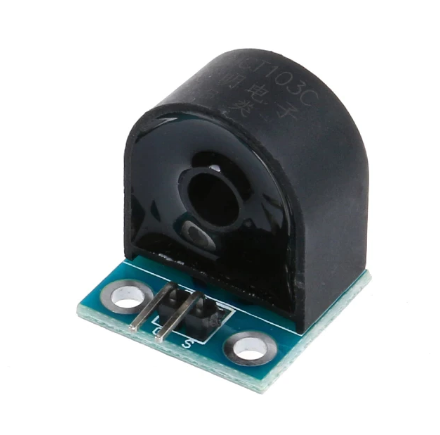

# esp32-doorbell
Use an esp32 with a CT103C to make a doorbell smarter

You will need to make a file `network_conn.h` with contents similar to

    const char* ssid       = "your-ssid";
    const char* password   = "your-wpa-passwd";
    const char* mqttServer = "your-MQTT-server";
    const int mqttPort     = 1883;

in order to provide details of your network and MQTT server

The MQTT channels are based off the word "doorbell" and the last 6 digits
of the MAC
   
     e.g  doorbell/123456/front_door
     e.g  doorbell/123456/back_door
   
Uses PubSubClient library
   
GPL2.0 or later.  See GPL LICENSE file for details.
Original code by Stephen Harris, Sep 2021

## How this works

A normal doorbell has a simple circuit that's basically an AC power
(maybe 16V) supply connected to a button connected to a solenoid that
throws a hammer to hit a chime.  When you press the button the circuit
is closed and the chime rings

Now this can't be read directly by Arduino/ESP8266/ESP32 type devices
because of the 16V AC supply.

But what we _can_ do is detect the current flow with a simple current
sensor.   With a device like a CT103C you can run one of the cables
through the sensor.  It outputs a signal proportional to the current,
and this can be read by an analog port.

The ones I have looks a lot like this:



Many homes have two doorbells (front and back).  These are effectively
two different circuits, so you need two sensors and two ADC ports.  If
you also need WiFi that pretty much means an ESP32 (or an Arduino with
a WiFi hat).  I went down the ESP32 route.

This sketch also has "hidden" hooks for OTA updates via HTTP,
based off my [example sketch](https:github.com/sweharris/esp8266-example)
but minor modifications for ESP32 (since the libraries are different)

When a button is pressed a message is sent to the MQTT server

The MQTT channels are based off the word "doorbell" and the last 6 digits
of the MAC
  eg doorbell/123456/front_door
     doorbell/123456/back_door

This message can be used as a trigger for HomeAssistant, for example.

```
- alias: Back Doorbell
  initial_state: false
  trigger:
    - platform: mqtt
      topic: doorbell/123456/back_doorbell
      payload: 'pressed'
  action:
    ....

- alias: Front Doorbell
  initial_state: false
  trigger:
    - platform: mqtt
      topic: doorbell/123456/front_doorbell
      payload: 'pressed'
  action:
    ....
```

You could flash lights (helpful for deaf people), alert your phone (if
you're out of home), popup a message on a smart TV...
